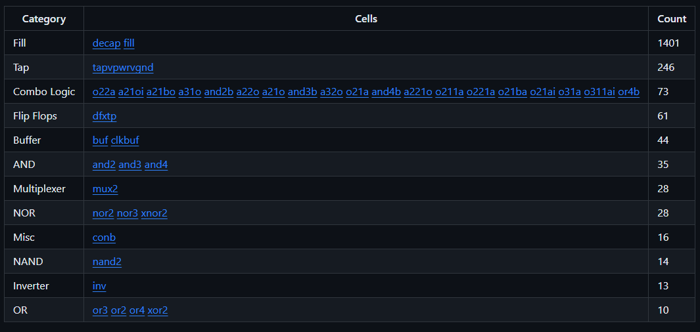

  

# SAP-1 Computer with an ASIC

Originally, Malvino and Brown presented the SAP-1 architecture in a book called Digital Computer Electronics. 
The design gained massive popularity when it was build as a bread board computer by Ben Eater on a series of YouTube videos. 
The architecture contains various modules, including
- Clock 
- Program Counter
- Register A
- Register B
- Adder
- Memory
- Instruction Register
- Bus
- Controller

This design doesn't have inputs, it is dependent only on the clock that coordinates sequence of the computer's operation. 
Its operation consists on the communication that that bus provides between modules; the signal load dumps information into a module
and the enable signal allows the bus to receive a signal. The bus is 8-bit width since it is an 8 bit computer, and the registers
are also 8-bit registers. 
The computer can only perform addition, whether it is positive numbers or negative numbers (substraction). 
The signals information is stored within the memory module. There bus operations are coordinated with a series of multiplexers and      
the instruction execution set gives the SAP-1 a total of six stages from 0 to 5, repeating all over again. 
The more important module      is the controller. It controlls the assertion execution according to the stimuli from the stages.
The stages 3 to 5 five depend on the instructions of the operation codes. 

# Runs info

Main run can be observed here https://github.com/brandcrz88/SAP-1_Computer/actions/runs/6740984456

This is how the GDS looks like 

Routing stats

Cell usage 

